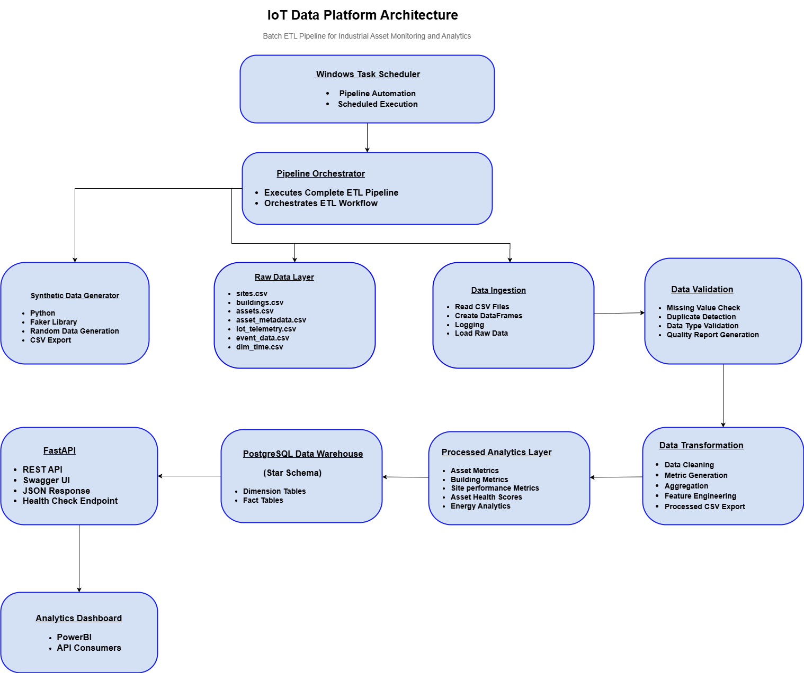
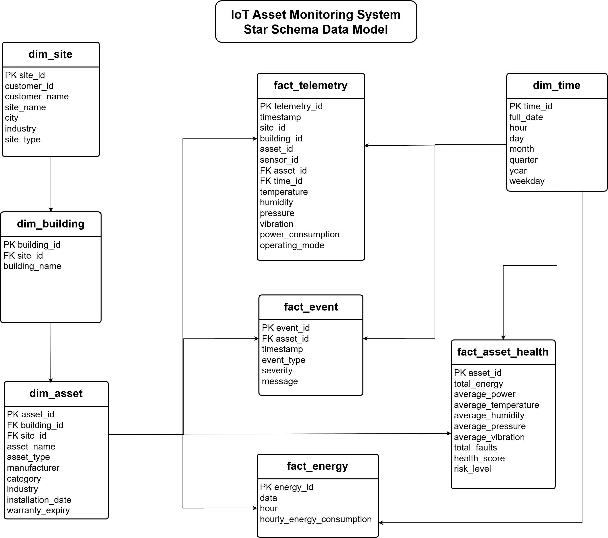

# 🚀 IoT Data Engineering Pipeline

> A production-style Batch ETL Data Engineering Pipeline for Industrial IoT Asset Monitoring using Python, PostgreSQL, FastAPI, and Windows Task Scheduler.

---

## 📖 Project Overview

The **IoT Data Engineering Pipeline** is an end-to-end Batch ETL solution designed to simulate a real-world Industrial IoT Asset Monitoring platform.

The pipeline automatically generates synthetic IoT telemetry data, validates data quality, transforms raw datasets into analytics-ready information, loads processed data into a PostgreSQL Data Warehouse using a Star Schema, and exposes the data through RESTful APIs using FastAPI.

The project demonstrates industry-standard Data Engineering concepts including:

- Batch ETL Pipeline
- Synthetic Data Generation
- Data Validation
- Data Transformation
- Data Modeling
- PostgreSQL Data Warehouse
- FastAPI REST API
- Pipeline Automation
- Logging & Monitoring

---

## 🎯 Project Objectives

- Build an end-to-end Batch ETL Pipeline
- Generate realistic Industrial IoT synthetic datasets
- Validate incoming data for quality and consistency
- Transform raw datasets into business-ready analytics
- Design a Star Schema Data Warehouse
- Load processed data into PostgreSQL
- Expose data through REST APIs using FastAPI
- Automate the ETL pipeline using Windows Task Scheduler

---

# 🏗️ System Architecture

<p align="center">
  
</p>

---

# 🗄️ Data Modeling

The project implements a **Dimensional Data Model (Star Schema)** to support efficient analytical querying and reporting.

### Dimension Tables

- dim_site
- dim_building
- dim_asset
- dim_time

### Fact Tables

- fact_telemetry
- fact_event
- fact_energy
- fact_asset_health

---

## 📊 Entity Relationship Diagram

<p align="center">
  
</p>

The SQL scripts and database design are available in:

```text
data modeling/
├── schema.sql
└── README.md
```

The project also includes:

- ER Diagram
- Star Schema Design
- Indexing Strategy
- Partitioning Strategy
- Multi-Asset Hierarchy
- Schema Definitions

---

# 🛠️ Technology Stack

| Category | Technology |
|----------|------------|
| Programming Language | Python 3.x |
| Data Processing | Pandas |
| Synthetic Data Generation | Faker |
| Database | PostgreSQL |
| Database Connectivity | SQLAlchemy, psycopg2 |
| API Framework | FastAPI |
| API Documentation | Swagger UI (OpenAPI) |
| Data Modeling | Star Schema, ER Diagram |
| Scheduling | Windows Task Scheduler |
| Logging | Python Logging |
| Version Control | Git, GitHub |

---

# 📂 Project Structure

```text
IoT-Data-Engineering-Pipeline/
│
├── data/
│   ├── raw/
│   ├── processed/
│   └── validated/
│
├── docs/
│   ├── architecture.png
│   ├── er_diagram.png
│   ├── indexing_strategy.md
│   ├── partitioning_strategy.md
│   ├── multi_asset_hierarchy.md
│   └── schema_definitions.md
│
├── data modeling/
│   ├── schema.sql
│   └── README.md
│
├── logs/
│
├── sql/
│   ├── asset_connectivity.sql
│   └── sql_challenge.sql
│
├── src/
│   ├── api.py
│   ├── config.py
│   ├── generate_synthetic_data.py
│   ├── generate_building_data.py
│   ├── generate_time_dimension.py
│   ├── data_ingestion.py
│   ├── data_validation.py
│   ├── data_transformation.py
│   ├── load_to_postgresql.py
│   └── pipeline_orchestrator.py
│
├── .env.example
├── .gitignore
├── README.md
└── requirements.txt
```

---

# 🔄 ETL Pipeline Workflow

The project follows a structured Batch ETL workflow to process Industrial IoT data.

### Step 1 – Synthetic Data Generation

Generate realistic Industrial IoT datasets including:

- Site Data
- Building Data
- Asset Data
- Asset Metadata
- IoT Telemetry
- Event Data
- Time Dimension

↓

### Step 2 – Data Ingestion

Read raw CSV files into Pandas DataFrames for further processing.

↓

### Step 3 – Data Validation

Validate incoming datasets by performing:

- Missing Value Detection
- Duplicate Detection
- Data Type Validation
- Data Quality Reporting

↓

### Step 4 – Data Transformation

Transform raw datasets into business-ready analytical datasets by performing:

- Data Cleaning
- Feature Engineering
- KPI Generation
- Asset Health Score Calculation
- Building Metrics
- Site Metrics
- Energy Analytics

↓

### Step 5 – Data Warehouse Loading

Load processed datasets into a PostgreSQL Data Warehouse using a Star Schema consisting of Dimension and Fact tables.

↓

### Step 6 – REST API

Expose processed warehouse data through FastAPI REST endpoints with interactive Swagger UI documentation.

↓

### Step 7 – Pipeline Automation

Automate the complete ETL workflow using Windows Task Scheduler and the Pipeline Orchestrator.

---

# 🚀 Getting Started

## Prerequisites

Before running the project, ensure the following software is installed:

- Python 3.10 or above
- PostgreSQL 15+
- Git
- Visual Studio Code (Recommended)

---

## 📦 Installation

### Clone the Repository

```bash
git clone https://github.com/<your-username>/<repository-name>.git
cd <repository-name>
```

### Create a Virtual Environment

```bash
python -m venv .venv
```

### Activate Virtual Environment

**Windows**

```bash
.venv\Scripts\activate
```

### Install Dependencies

```bash
pip install -r requirements.txt
```

---

# ⚙️ Configuration

Create a `.env` file in the project root.

Example:

```env
DB_HOST=localhost
DB_PORT=5432
DB_NAME=nectar_iot_dw
DB_USER=postgres
DB_PASSWORD=your_password
```

---

# 🗃️ PostgreSQL Database Setup

1. Install PostgreSQL.
2. Create a database named:

```text
nectar_iot_dw
```

3. Execute the SQL schema available in:

```text
data modeling/schema.sql
```

This creates the required Fact and Dimension tables.

---

# ▶️ Running the ETL Pipeline

Execute the complete pipeline using the Pipeline Orchestrator.

```bash
python src/pipeline_orchestrator.py
```

The orchestrator performs:

- Synthetic Data Generation
- Data Ingestion
- Data Validation
- Data Transformation
- PostgreSQL Loading

---

# 🌐 Running the FastAPI Server

Start the API server:

```bash
uvicorn src.api:app --reload
```

Open your browser:

```text
http://127.0.0.1:8000/docs
```

Swagger UI provides interactive documentation for all available API endpoints.

---

# ⏰ Pipeline Automation

The ETL pipeline can be automated using **Windows Task Scheduler**.

Automation Flow:

- Launches Pipeline Orchestrator
- Executes Complete ETL Workflow
- Generates Logs
- Refreshes the PostgreSQL Data Warehouse

---

# 📁 Logging

The project generates execution logs and data quality reports inside the `logs/` directory.

Example outputs:

```text
logs/
├── data_ingestion.log
├── data_validation.log
├── data_transformation.log
└── data_quality_report.json
```

---

# 📌 Project Deliverables

✔ Synthetic Data Generation

✔ Batch ETL Pipeline

✔ Data Validation

✔ Data Transformation

✔ PostgreSQL Data Warehouse

✔ Star Schema Data Modeling

✔ ER Diagram

✔ SQL Challenges

✔ FastAPI REST API

✔ Swagger Documentation

✔ Windows Task Scheduler

✔ GitHub Repository

✔ Project Documentation

✔ Architecture Diagram

---

# 🚀 Future Enhancements

- Apache Airflow Pipeline Orchestration
- Docker Containerization
- Cloud Deployment (AWS / Azure / GCP)
- Real-time Streaming using Apache Kafka
- Power BI Dashboard
- CI/CD Pipeline
- Monitoring & Alerting
- Role-Based Authentication
- Automated Testing

---

# 👩‍💻 Author

**Sai Deepthi**

Data Engineering | Machine Learning | Generative AI

GitHub: https://github.com/<your-github-# 🚀 Getting Started

## Prerequisites

Before running the project, ensure the following software is installed:

- Python 3.10 or above
- PostgreSQL 15+
- Git
- Visual Studio Code (Recommended)

---

## 📦 Installation

### Clone the Repository

```bash
git clone https://github.com/Deepthisai22/Iot-data-engineering-pipeline.git
cd Iot-data-engineering-pipeline
```

### Create a Virtual Environment

```bash
python -m venv .venv
```

### Activate Virtual Environment

**Windows**

```bash
.venv\Scripts\activate
```

### Install Dependencies

```bash
pip install -r requirements.txt
```

---

# ⚙️ Configuration

Create a `.env` file in the project root.

Example:

```env
DB_HOST=localhost
DB_PORT=5432
DB_NAME=nectar_iot_dw
DB_USER=postgres
DB_PASSWORD=your_password
```

---

# 🗃️ PostgreSQL Database Setup

1. Install PostgreSQL.
2. Create a database named:

```text
nectar_iot_dw
```

3. Execute the SQL schema available in:

```text
data modeling/schema.sql
```

This creates the required Fact and Dimension tables.

---

# ▶️ Running the ETL Pipeline

Execute the complete pipeline using the Pipeline Orchestrator.

```bash
python src/pipeline_orchestrator.py
```

The orchestrator performs:

- Synthetic Data Generation
- Data Ingestion
- Data Validation
- Data Transformation
- PostgreSQL Loading

---

# 🌐 Running the FastAPI Server

Start the API server:

```bash
uvicorn src.api:app --reload
```

Open your browser:

```text
http://127.0.0.1:8000/docs
```

Swagger UI provides interactive documentation for all available API endpoints.

---

# ⏰ Pipeline Automation

The ETL pipeline can be automated using **Windows Task Scheduler**.

Automation Flow:

- Launches Pipeline Orchestrator
- Executes Complete ETL Workflow
- Generates Logs
- Refreshes the PostgreSQL Data Warehouse

---

# 📁 Logging

The project generates execution logs and data quality reports inside the `logs/` directory.

Example outputs:

```text
logs/
├── data_ingestion.log
├── data_validation.log
├── data_transformation.log
└── data_quality_report.json
```

---

# 📌 Project Deliverables

✔ Synthetic Data Generation

✔ Batch ETL Pipeline

✔ Data Validation

✔ Data Transformation

✔ PostgreSQL Data Warehouse

✔ Star Schema Data Modeling

✔ ER Diagram

✔ SQL Challenges

✔ FastAPI REST API

✔ Swagger Documentation

✔ Windows Task Scheduler

✔ GitHub Repository

✔ Project Documentation

✔ Architecture Diagram

---

# 🚀 Future Enhancements

- Apache Airflow Pipeline Orchestration
- Docker Containerization
- Cloud Deployment (AWS / Azure / GCP)
- Real-time Streaming using Apache Kafka
- Power BI Dashboard
- CI/CD Pipeline
- Monitoring & Alerting
- Role-Based Authentication
- Automated Testing

---

# 👩‍💻 Author

**Sai Deepthi**

Data Science | Data Engineering | Machine Learning | Generative AI

GitHub: https://github.com/Deepthisai22>

LinkedIn: https://linkedin.com/in/saideepthi22>

---

# ⭐ Support

If you found this project helpful, consider giving it a ⭐ on GitHub.

---

# 📄 License

This project is intended for educational and portfolio purposes.